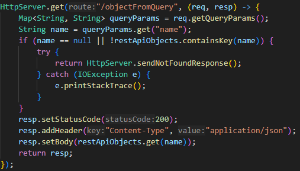

# Web Server

This laboratory allows you to explore various aspects of network connections, providing a foundation for understanding how URLs work, how sockets establish basic server-client communication, and how to create a web server running on port 35000.

The server can handle requests for HTML, CSS, JavaScript, and image files, as well as expose a REST API that creates objects based on query parameters—all implemented using Java's networking library.

A key feature of this project is the ability to define your own server logic using lambda functions, enabling flexible and efficient handling of different types of requests.

## Getting Started

This project is built in Java using Maven. No additional dependencies are required, except for the JUnit Jupiter dependency to run the project tests.


### Prerequisites

Before running this project, ensure you have the following installed on your system:

* Java Development Kit (JDK) 21
    * Download and install from: [Oracle JDK or OpenJDK](https://www.oracle.com/co/java/technologies/downloads/)
    * Verify installation with:
        ```
        java -version
        ```
* Apache Maven (for dependency management and build automation)
    * Install from: [Maven Downloads](https://maven.apache.org/download.cgi#Installation)
    * Verify installation with:
        ```
        mvn -version
        ```
* Git (to clone the repository)
    * Install from: [Git Downloads](https://git-scm.com/downloads)
    * Verify installation with:
        ```
        git --version
        ```

### Installing

Follow these steps to set up and run the project in your local development environment:

Clone the Repository:

```
git clone https://github.com/MateoSebF/Taller2_AREP

```

Navigate to the Project Directory:

```
cd Taller1_AREP
```

Build the Project with Maven:

```
mvn clean compile
```

Run the Web Server:

```
mvn clean compile exec:java
```
### Architecture
The core architecture of this project revolves around the HTTP protocol. At its center, we have an HttpServer that manages incoming user requests. To ensure scalability and maintainability, the design includes two complementary components: HttpRequest and HttpResponse. These two classes standardize the input and output of the server, considering key aspects such as:


To use this framework effectively, you need to understand how requests and responses work, particularly when handling them within lambda functions. This includes extracting query parameters, analyzing the URI, and more.

To ensure proper functionality, your lambda functions must return an HttpResponse, specifying the status code, headers, and body using the appropriate setter methods.

An important aspect to configure is the location from which the server will serve static files. By default, it uses the /src/main/resources/static folder.

A complete example demonstrating the use of HTML, CSS, JavaScript, and images is already set up. You can find and test this example in the WebServer class.

Currently, the server supports the GET, POST, PUT, and UPDATE methods, each requiring the appropriate handler function. Here’s a complete usage example:



### Test the REST serices
To test this setup, you can use the following endpoint after running the WebServer. By default, it will serve static files from the correct folder:

http://localhost:35000/images/placeholder.png

This request should return the following image:


## Running the tests

To run the automated tests for this system, you can use Maven, which integrates well with JUnit for running tests. These tests help ensure that the application is working as expected and validate the behavior of the system.

You can run all tests in the system using the following Maven command:

```
mvn test
```

### Break down into end to end tests

The following tests verify the functionality of the server by simulating HTTP requests for different types of files (HTML, CSS, JS, images) and checking the server's responses. These tests ensure that the server handles the requests correctly, serves the expected content, and returns the appropriate status codes.

For example, the testMakeConnectionHTML() test checks if the server successfully responds to a request for index.html with a 200 OK status. This ensures that the server is running and can handle requests for HTML pages correctly.

Additionally, I’ve introduced a test class for the HttpRequest to verify its functionality. This includes verifying that the HttpRequest class handles the reading of requests correctly, particularly when the request body is read as a String.

### And coding style tests

These tests ensure that the code follows standard Java coding conventions and best practices, including naming conventions, documentation, and formatting. These tests help maintain consistency, readability, and clarity across the project.

For example, the **testMethodNamingConvention()** test verifies that all method names follow the camelCase convention, a widely accepted naming style in Java. This helps maintain a consistent coding style across the projec

## Deployment

To deploy this project to a cloud environment, the application needs to be configured to dynamically listen on the appropriate port, typically provided as an environment variable. Additionally, you must ensure that all static resources (HTML, CSS, JS, and images) are correctly placed in accessible directories or bundled with the deployment package. The project should also be updated to handle logging properly, as cloud platforms do not typically display console output by default. Finally, ensure that the application is packaged correctly, often as a .jar file, and that it is set up to run continuously in the cloud environment.

## Built With

* [Java](https://www.oracle.com/co/java/technologies/downloads/) - The programming language used
* [Maven](https://maven.apache.org/) - Dependency Management
* [JUnit](https://junit.org/junit5/) - Testing Framework for unit tests

## Versioning

We use [Conventional Commits](https://www.conventionalcommits.org/en/v1.0.0/) for versioning.  

## Authors

**Mateo Forero** - *Initial work* - [MateoSebF](https://github.com/MateoSebF)

## Acknowledgments

* Inspiration from various resources and tutorials on building simple HTTP servers.